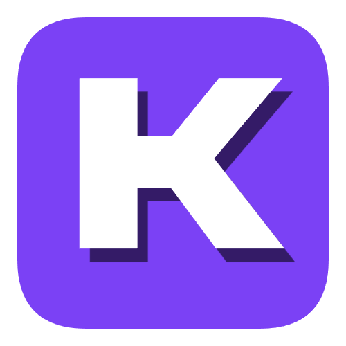
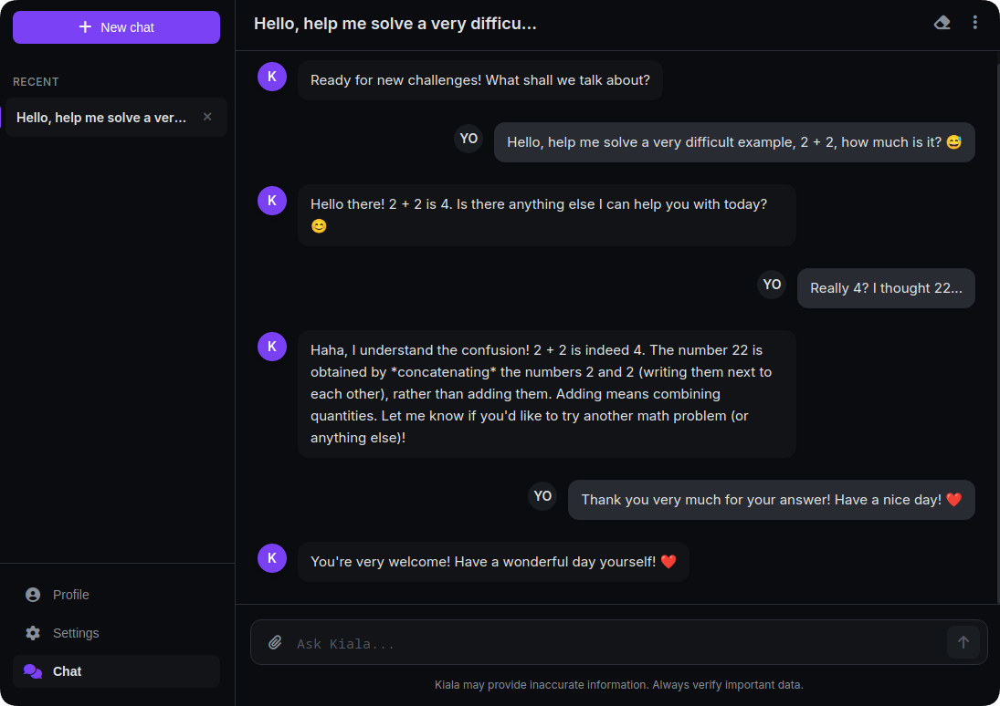
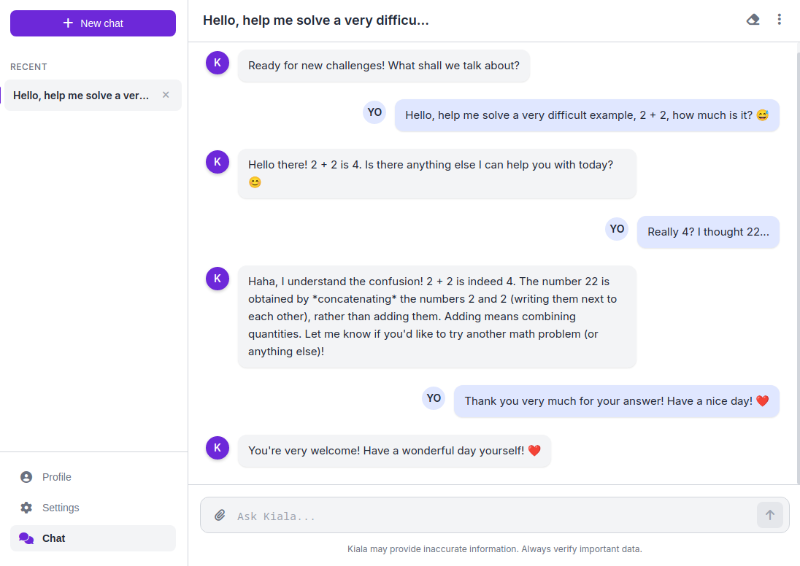

<div align="center">


# Kiala - Desktop AI assistant 

**Version: v.0.1A**

[](https://github.com/Jac-qquard/Kiala)
[](https://www.python.org/)
[](https://flask.palletsprojects.com/)
[](https://pywebview.flowrl.com/)
[](https://ai.google.dev/)
[](LICENSE)

**Kiala** is a cross-platform desktop AI assistant designed for comfortable and productive interaction with the powerful Gemini model. The project combines a Python backend on Flask and a modern web interface, packaged into one convenient desktop application.

**[🌐 Visit Project Website]()**

</div>

---

## 📸 Screenshots

<div align="center">
<table>
  <tr>
    <td></td>
    <td></td>
  </tr>
  <tr>
    <td align="center"><em>Main Interface (Dark Theme)</em></td>
    <td align="center"><em>Light Theme and Settings</em></td>
  </tr>
</table>
</div>

---

## ✨ Key Features

-   **Direct Interaction with Gemini**: Chat with the Gemini 1.5 Flash model in real-time.
-   **Chat History**: All your conversations are saved locally and are accessible in the sidebar.
-   **Chat Management**: Create, rename, delete, and clear chats.
-   **Personalization**:
    -   Theme support (Dark, Light, System).
    -   Compact message display mode.
    -   Configuration of a global "system instruction" to control AI behavior.
    -   Option to use your own Gemini API key.
-   **Modern Interface**: Clean, responsive, and intuitive design.
-   **Markdown Support**: AI responses are formatted with syntax highlighting for code, lists, etc.
-   **Import/Export**: Save and load your entire chat history in JSON format.
-   **Cross-platform**: Works on Windows, macOS, and Linux.

---

## 🛠️ Tech Stack

| Category   | Technology                                                                                             | Description                                                               |
| :--------- | :----------------------------------------------------------------------------------------------------- | :------------------------------------------------------------------------ |
| **Backend**  |          | The main programming language.                                            |
|            |              | A microframework for creating the local web server and API.               |
| **Frontend** |              | The structure of the user interface.                                      |
|            |                | Styling and design of the application.                                    |
|            |       | Client-side logic, API interaction, and state management.                 |
| **GUI**    |                                    | A library for displaying web content in a native OS window.               |
|            |                  | The GUI framework used by `pywebview` to create the window.               |
| **AI**     |                                | The core language model for generating responses.                         |

---

## 🚀 Getting Started

### Prerequisites

-   Python 3.9 or newer.
-   `pip` (Python package manager).
-   [Gemini API Key](https://aistudio.google.com/app/apikey).

### Installation and Launch

1.  **Clone the repository:**
    ```bash
    git clone https://github.com/Jac-qquard/Kiala-v.0.1A.git
    cd Kiala-v.0.1A
    ```

2.  **Create and activate a virtual environment (recommended):**
    ```bash
    # For Windows
    python -m venv venv
    .\venv\Scripts\activate

    # For macOS/Linux
    python3 -m venv venv
    source venv/bin/activate
    ```

3.  **Install dependencies:**
    ```bash
    pip install -r requirements.txt
    ```

4.  **Configure the API Key:**
    You can add your key in two ways:
    -   **(Recommended)** Create a `.env` file in the project's root directory and add your key to it:
        ```
        GEMINI_API_KEY=YOUR_KEY_HERE
        ```
    -   Or, paste the key directly into the application's interface in the "Settings" section.

5.  **Run the application:**
    ```bash
    python run.py
    ```

---

## 📁 Project Structure

```
Kiala/
│
├── app/
│   ├── core/
│   │   ├── __init__.py
│   │   └── gemini_client.py   # Module for interacting with the Gemini API
│   │
│   ├── static/
│   │   ├── css/
│   │   │   └── style.css      # Interface styles
│   │   ├── img/
│   │   └── js/
│   │       └── script.js      # Client-side logic
│   │
│   ├── templates/
│   │   └── index.html         # Application structure
│   │
│   ├── __init__.py
│   └── main.py                # Main file: Flask server and pywebview window creation
│
├── requirements.txt           # List of Python dependencies
└── run.py                     # Application entry point
```

---

## 🔬 Detailed Code Breakdown

### `run.py` (Entry Point)

This is the main script that launches the entire application.

-   **`import sys, main_app_loop`**: Imports the system module and the main application loop function.
-   **`if __name__ == '__main__':`**: Standard entry point for a Python script.
-   **`print(...)`**: Outputs launch information, Python version, and platform to the console.
-   **`try...except...finally`**: A global error handler.
    -   `main_app_loop()`: Starts the main application loop from `app/main.py`.
    -   `except KeyboardInterrupt`: Gracefully handles keyboard interrupts (Ctrl+C) by printing a shutdown message.
    -   `except Exception as e`: Catches any other unexpected errors that could crash the application and prints them to `stderr`.
    -   `finally`: Ensures that the shutdown message and program exit (`sys.exit(0)`) are executed in any case.

### `requirements.txt` (Dependencies)

-   **`Flask>=2.3.0`**: The web server for the backend, which handles API requests from the frontend.
-   **`python-dotenv>=1.0.0`**: Loads environment variables (like the API key) from a `.env` file.
-   **`google-generativeai>=0.5.0`**: The official Google library for working with the Gemini API.
-   **`pywebview>=4.6.0`**: Creates a native desktop window and displays the web interface (HTML/CSS/JS) inside it.
-   **`requests>=2.30.0`**: A popular library for HTTP requests (though not used directly in this code, it's a standard dependency for many projects).
-   **`PyQt6>=6.6.0`**: A GUI framework that `pywebview` uses to render the window. A comment in the file suggests the possible need to use `PyQt5` for compatibility issues.

### `app/main.py` (The Heart of the Application)

This file ties the backend (Flask) and frontend (pywebview) together.

-   **Path Handling**: The code at the beginning correctly determines the paths to the `templates` and `static` folders, allowing the application to work both in development mode and after being packaged into an executable (e.g., with PyInstaller).
-   **`app = Flask(...)`**: Initializes the Flask application.
-   **`@app.route('/')`**: The main route.
    -   Returns `index.html`, the main interface file.
    -   Sets `Cache-Control` headers to prevent caching, ensuring the latest UI version is loaded on every launch.
-   **`@app.route('/api/ask_gemini', methods=['POST'])`**: The API endpoint for the chat.
    -   Receives JSON data from the frontend: the user's message, chat history, API key, and system instruction.
    -   Converts the chat history into a format understandable by `google-generativeai`.
    -   Calls `get_gemini_response_sync()` to get a response from the AI.
    -   Returns the response in JSON format or an error message.
-   **`run_flask_app()`**: A function that starts the Flask server. It runs in a separate thread to avoid blocking the main GUI thread.
-   **`create_gui()`**: The function that creates and configures the `pywebview` window (title, dimensions, icon). `url=flask_server_url` tells `pywebview` to load content from our local Flask server.
-   **`on_window_closed()`**: An event handler for when the window is closed. `os._exit(0)` forcefully terminates the entire process, including the background Flask thread.
-   **`main_app_loop()`**: The main control function.
    -   Creates and starts `run_flask_app` in a `daemon` thread.
    -   In the main thread, it calls `create_gui()`, which blocks until the window is closed.
    -   Includes a fallback mechanism using `tkinter` to display a native error window if `pywebview` fails to start.

### `app/core/gemini_client.py` (Gemini Client)

A wrapper module for working with the Gemini API.

-   **Configuration**: Defines constants for model settings (temperature, `top_p`, etc.) and safety parameters.
-   **Global Variables (`_model_instance`, `_current_api_key`, ...)**: Used to cache the initialized model. This prevents re-initialization on every request, saving time and resources.
-   **`_initialize_model_if_needed(...)`**:
    -   Checks if the model needs to be (re)initialized. This happens on the first call or if the API key/system instruction has changed.
    -   Configures `genai` with the API key and creates an instance of `genai.GenerativeModel`.
    -   Contains robust error handling, for example, for an invalid API key.
-   **`get_gemini_response_sync(...)`**:
    -   The main function for sending a request.
    -   Calls `_initialize_model_if_needed`.
    -   Truncates the message history (`MAX_HISTORY_MESSAGES`) to avoid exceeding the token limit.
    -   Sends a synchronous request `_model_instance.generate_content()`.
    -   **Response Handling**: Handles possible responses in great detail:
        -   Checks if the response was blocked by the safety system.
        -   Tries to get text from `response.text`. If this fails (e.g., due to a block), it tries to assemble it from `response.parts`.
        -   **Error Handling**: Returns user-friendly error messages (invalid key, quota exceeded, timeout, etc.).
-   **`if __name__ == "__main__":`**: Contains test calls, which is good practice for verifying the module's functionality in isolation.

### `app/templates/index.html` (UI Structure)

The HTML file that defines the skeleton of the entire graphical interface.

-   **`aside.sidebar-grok`**: The sidebar with the "New Chat" button, a list of recent conversations, and navigation (Profile, Settings, Chat).
-   **`main.main-content-grok`**: The main content area.
-   **`.content-view`**: The three main "screens" of the application:
    -   **`#chat-view`**: The main chat screen with messages and the input field.
    -   **`#settings-view`**: The settings screen, where you can change the theme, API key, system instructions, etc.
    -   **`#profile-view`**: The profile screen with avatar settings and import/export buttons.
-   **Modal Windows (`.modal-grok`)**:
    -   `#rename-chat-modal`: For renaming a chat.
    -   `#confirmation-modal`: A universal window for confirming destructive actions (delete, clear).
-   **`#toast-container-grok`**: A container for pop-up notifications (toasts).
-   **Script Inclusion**: At the end of the file, it includes the `marked.js` library (for rendering Markdown), `dompurify.js` (for protection against XSS attacks when rendering HTML), and the main logic file `script.js`.

### `app/static/js/script.js` (Frontend Logic)

This file manages all the behavior of the interface.

-   **State Management**:
    -   `chatHistory`: An array of objects that stores all chats and messages.
    -   `userSettings`: An object that stores all user settings.
    -   `isGeminiResponding`: A flag that blocks sending new messages until a response to the previous one has been received.
-   **LocalStorage**: Functions for saving (`save...ToLS`) and loading (`load...FromLS`) state and settings to the browser's local storage. This ensures data persistence between sessions.
-   **Main Chat Logic**:
    -   `handleSendMessage()`: The key function. It gathers data, sends it to the backend, processes the response, and updates the UI.
    -   `fetchGeminiResponse()`: Uses `fetch` to send a POST request to the backend endpoint `/api/ask_gemini`.
    -   `appendMessageToDOM()`: Creates an HTML element for a new message and adds it to the chat. Importantly, it uses `marked` and `DOMPurify` to safely display the AI's response.
-   **Rendering**:
    -   `renderHistoryList()`: Updates the chat list in the sidebar.
    -   `renderCurrentChatMessages()`: Displays all messages for the currently active chat.
-   **Event Handlers**:
    -   Listeners on all buttons, input fields, and switches.
    -   Logic for automatically adjusting the height of the text input area.
    -   Management of modal windows and pop-up notifications (`showToast`).
-   **Import/Export**: Implements logic for exporting chat history to a JSON file and importing from it using `Blob` and `FileReader`.
-   **`initializeKiala()`**: The function that runs when the page loads. It loads settings, history, renders the initial interface, and prepares the application for use.

### `app/static/css/style.css` (Styles)

The file responsible for the application's appearance.

-   **CSS Variables (`:root`)**: Extensive use of variables for colors, sizes, and fonts. This makes changing themes and adjusting the design very simple.
-   **Theming**: The `.light-theme` class overrides the variables in `:root` to switch to the light theme.
-   **Responsiveness (`@media`)**: Media queries are used to adapt the interface to different window sizes. On small screens, the sidebar becomes a slide-out menu.
-   **Animations**: Smooth transitions (`transition`) and animations (`@keyframes`) make the interface more lively and visually appealing (message appearance, modal opening).
-   **Markdown Styling**: Defines styles for elements generated by `marked.js`, particularly for code blocks (`pre`, `code`).
-   **Component-based Approach**: Styles are well-structured by component (sidebar, message, input-area, modal), which makes them easier to maintain.

---

## 💡 How It Works: Architecture

1.  **Launch**: `run.py` starts the main loop in `app/main.py`.
2.  **Two Threads**: `main_app_loop` creates two threads:
    -   **Background Thread (Daemon)**: The **Flask server** is started, listening on a local address (`http://127.0.0.1:5175`). It waits for API requests.
    -   **Main Thread**: **pywebview** is started, which creates a native OS window and loads the web page from the Flask server's address into it.
3.  **Interaction**:
    -   The user types a message in the interface (HTML/JS).
    -   `script.js` sends a `fetch` request to `/api/ask_gemini` on the local Flask server.
    -   The Flask endpoint in `main.py` receives the request.
    -   It calls a function from `gemini_client.py`, which then sends a request to the actual Google Gemini API over the internet.
    -   The response from Gemini is returned up the chain: `gemini_client` -> `main.py` -> `script.js`.
    -   `script.js` receives the response and displays it in the interface, rendering the Markdown.

This architecture allows for leveraging the power and flexibility of web technologies (HTML, CSS, JS) to create a beautiful and complex interface, while Python handles all the heavy lifting on the backend.

---

## 📜 License

This project is distributed under the MIT License. See the `LICENSE` file for details.